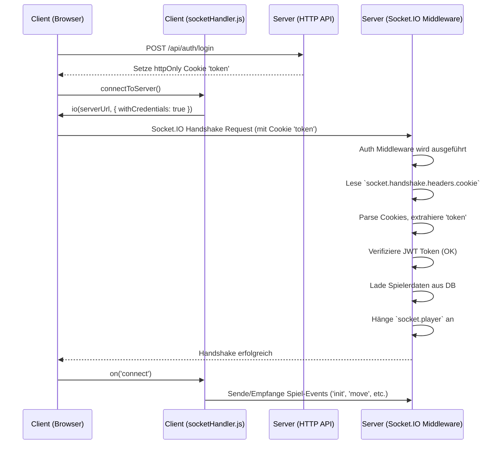

# Plan zur Behebung des Socket.IO Authentifizierungsfehlers

**Problem:** Nach dem Login bleibt das Spielfenster (`game.html`) weiß. Die Server-Logs zeigen `Socket Auth fehlgeschlagen (...): Kein Token.`.

**Analyse:**

1.  **Client (`client/js/modules/socketHandler.js`):** Versucht, sich via `httpOnly` Cookie zu authentifizieren (`withCredentials: true`). Sendet den Token *nicht* explizit im `auth`-Objekt.
2.  **Server (`server/index.js`):**
    *   CORS ist korrekt konfiguriert (`credentials: true`).
    *   Die Socket.IO Auth Middleware (`io.use`) erwartet den Token fälschlicherweise in `socket.handshake.auth.token`.
    *   Die Middleware liest den Token *nicht* aus dem Cookie (`socket.handshake.headers.cookie`), der vom Client gesendet wird.

**Ursache:** Diskrepanz zwischen Client (sendet Token via Cookie) und Server (erwartet Token in `socket.handshake.auth`).

**Lösung:** Anpassung der Socket.IO Authentifizierungs-Middleware in `server/index.js`.

**Schritte:**

1.  **Middleware anpassen (`io.use` in `server/index.js`):**
    *   Zugriff auf den Cookie-String: `socket.handshake.headers.cookie`.
    *   Cookie parsen: Den `cookie-parser` (oder eine ähnliche Logik) verwenden, um den JWT-Cookie (vermutlich `token`) zu extrahieren.
        *   **Wichtig:** Der `cookie-parser` muss *vor* der Socket.IO-Middleware initialisiert werden, damit er die Cookies im `socket.request` verfügbar macht. Alternativ kann man den Cookie-String manuell parsen.
    *   Token verifizieren: Den extrahierten Token mit `jwt.verify` überprüfen.
    *   Spielerdaten laden und an `socket.player` anhängen (wie bisher).
    *   Fehlerbehandlung beibehalten/anpassen.

2.  **Abhängigkeiten prüfen:** Sicherstellen, dass `cookie-parser` in `server/package.json` vorhanden ist.

**Visueller Ablauf (korrigiert):**

**Nächster Schritt:** Wechsel in den Code-Modus zur Implementierung der Änderungen in `server/index.js`.